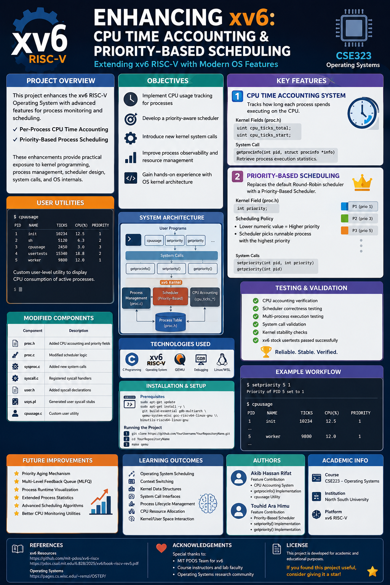

# Enhancing xv6: CPU Time Accounting & Priority-Based Scheduling

<div align="center">

[](https://github.com/mit-pdos/xv6-riscv)
[](https://en.wikipedia.org/wiki/C_(programming_language))
[](https://pdos.csail.mit.edu/6.828/2025/xv6/book-riscv-rev5.pdf)
[](http://www.northsouth.edu/)
[](#)

</div>

---


# 📌 Project Overview

This repository presents an enhanced implementation of the **xv6 RISC-V Operating System**, a minimalist Unix-like teaching OS developed by MIT.

The project extends the stock xv6 kernel with modern operating system features focused on:

- ⚡ **Per-Process CPU Time Accounting**
- 🎯 **Priority-Based Process Scheduling**

These enhancements provide practical exposure to:

- Kernel-level programming
- Process management
- Scheduler design
- System call implementation
- Operating system internals

---

# 🎯 Project Objectives

The primary goal of this project was to transform xv6 from a basic educational operating system into a more feature-rich and observable system similar to real-world operating systems.

## Key Objectives

✔ Implement CPU usage tracking for processes  
✔ Develop a priority-aware scheduler  
✔ Introduce new kernel system calls  
✔ Improve process observability and resource management  
✔ Gain hands-on experience with OS kernel architecture

---

# ✨ Features

# 1️⃣ CPU Time Accounting System

Implemented a kernel-level CPU accounting mechanism to track how long each process spends executing on the CPU.

## 🔧 Kernel Enhancements

Added the following fields inside `kernel/proc.h`:

```c
uint cpu_ticks_total;
uint cpu_ticks_start;
```

These fields are updated during context switching and scheduler execution.

## 🧩 New System Call

```c
getprocinfo(int pid, struct procinfo *info)
```

This system call allows user-space programs to retrieve process execution statistics safely from the kernel.

## 🖥 User Utility

Created a custom user-level command:

```bash
cpuusage
```

The utility displays CPU consumption statistics for active processes.

---

# 2️⃣ Priority-Based Scheduling

Replaced the default Round-Robin scheduler with a **Priority-Based Scheduling Algorithm**.

## 🔧 Scheduler Modifications

Added a new process attribute:

```c
int priority;
```

### Scheduling Policy

- Lower numeric value = Higher priority
- Scheduler always selects the runnable process with the highest priority

---

## 🧩 New System Calls

### Set Process Priority

```c
setpriority(int pid, int priority)
```

### Get Process Priority

```c
getpriority(int pid)
```

These calls allow dynamic process priority management from user space.

---

# 🏗 System Architecture

## Modified Components

| Component | Description |
|---|---|
| `proc.h` | Added CPU accounting and priority fields |
| `proc.c` | Modified scheduler logic |
| `sysproc.c` | Added new system calls |
| `syscall.c` | Registered syscall handlers |
| `user.h` | Added syscall declarations |
| `usys.pl` | Generated user syscall stubs |
| `cpuusage.c` | Custom user utility |

---

# 🛠 Technologies Used

| Technology | Purpose |
|---|---|
| C Programming | Kernel Development |
| xv6 RISC-V | Operating System |
| QEMU | Hardware Emulator |
| GDB | Debugging |
| Linux / WSL | Development Environment |

---

# ⚙️ Installation & Setup

## 📋 Prerequisites

Install the required dependencies:

```bash
sudo apt-get update

sudo apt-get install -y \
git \
build-essential \
gdb-multiarch \
qemu-system-misc \
gcc-riscv64-linux-gnu \
binutils-riscv64-linux-gnu
```

---

# 🚀 Running the Project

## 1️⃣ Clone the Repository

```bash
git clone https://github.com/YourUsername/YourRepositoryName.git

cd YourRepositoryName
```

---

## 2️⃣ Build & Run xv6

```bash
make qemu
```

---

# 🧪 Testing the Features

Inside the xv6 shell:

## CPU Usage Monitoring

```bash
$ cpuusage
```

## Run xv6 Test Suite

```bash
$ usertests
```

---

# ✅ Testing & Validation

The system was tested extensively to ensure kernel stability and correctness.

## Validation Includes

✔ CPU accounting verification  
✔ Scheduler correctness testing  
✔ Multi-process execution testing  
✔ System call validation  
✔ Kernel stability checks  
✔ xv6 stock `usertests` passed successfully

---

# 📊 Example Workflow

## Setting Process Priority

```bash
$ setpriority 5 1
```

## Viewing CPU Usage

```bash
$ cpuusage
```

---

# 🚀 Future Improvements

Potential future enhancements include:

- ⭐ Priority Aging Mechanism
- ⭐ Multi-Level Feedback Queue (MLFQ)
- ⭐ Process Runtime Visualization
- ⭐ Extended Process Statistics
- ⭐ Advanced Scheduling Algorithms
- ⭐ Better CPU Monitoring Utilities

---

# 📚 Learning Outcomes

Through this project, we gained practical understanding of:

- Operating System Scheduling
- Context Switching
- Kernel Data Structures
- System Call Interfaces
- Process Lifecycle Management
- CPU Resource Allocation
- Kernel/User Space Interaction

---

# 👨‍💻 Authors

## 👤 Akib Hassan Rifat
### Feature Contribution
- CPU Accounting System
- `getprocinfo()` Implementation
- `cpuusage` Utility

---

## 👤 Touhid Ara Himu
### Feature Contribution
- Priority-Based Scheduler
- `setpriority()` Implementation
- `getpriority()` Implementation

---

# 🏫 Academic Information

| Information | Details |
|---|---|
| Course | CSE323 – Operating Systems |
| Institution | North South University |
| Platform | xv6 RISC-V |

---

# 📖 References

## xv6 Resources

- https://github.com/mit-pdos/xv6-riscv
- https://pdos.csail.mit.edu/6.828/2025/xv6/book-riscv-rev5.pdf

## Operating Systems

- https://pages.cs.wisc.edu/~remzi/OSTEP/

---

# ⭐ Acknowledgements

Special thanks to:

- MIT PDOS Team for xv6
- Course instructors and lab faculty
- Operating Systems research community

---

# 📜 License

This project is developed for academic and educational purposes.

---

<div align="center">

##  If you found this project useful, consider giving it a star!

</div>
